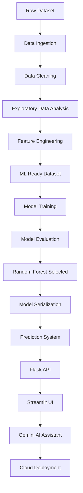

# 🌾 Crop Recommendation System using Machine Learning

**An End-to-End ML Solution for Smart Agriculture**


## Project Overview

This project is an end-to-end Machine Learning based Crop Recommendation System built using Python, scikit-learn, pandas, and Flask API integration.

The system recommends suitable crops based on agricultural and environmental conditions such as:

* Nitrogen (N)
* Phosphorus (P)
* Potassium (K)
* Temperature
* Humidity
* pH
* Rainfall

The project was designed to simulate a complete real-world ML workflow including:

* Data preprocessing
* Exploratory Data Analysis (EDA)
* Feature Engineering
* Machine Learning model training
* Model evaluation and comparison
* Model serialization using Joblib
* Prediction system development
* Flask API integration
* Pipeline automation
* Interactive Streamlit web application
* Cloud deployment using Streamlit Community Cloud
* LLM-powered AI Crop Assistant using Gemini

---

##  Project Structure

```bash
agri-crop-prediction/
├── data/
│   ├── raw/
│   ├── processed/
│   └── external/
│
├── models/
│   ├── crop_model.pkl
│   ├── scaler.pkl
│   └── model_columns.pkl
│
├── notebooks/
│   ├── 01_EDA.ipynb
│   ├── 02_cleaning.ipynb
│   ├── 03_feature_engineering.ipynb
│   └── 04_ML_model.ipynb
│
├── src/
│   ├── ingest.py
│   ├── clean.py
│   ├── features.py
│   ├── train.py
│   ├── predict.py
│   ├── pipeline.py
│   └── app.py
│
├── visuals/
│
├── streamlit_app.py
├── requirements.txt
├── README.md
└── .gitignore
```

---
## Dataset Information
Dataset: [Crop Recommendation Dataset](https://www.kaggle.com/datasets/atharvaingle/crop-recommendation-dataset)
Input Features:

* Nitrogen (N), Phosphorus (P), Potassium (K)
* Temperature, Humidity, pH, Rainfall

**Target Variable** : Crop Label (22 classes)
**Examples of crops** : Rice, Chickpea, Papaya, Coconut, Mango, Coffee, Watermelon, Cotton, etc.

## Complete Workflow


---

# 1. Data Ingestion
Raw dataset loaded and organized into modular structure.
Tasks performed:

* Dataset loading
* File structure organization
* Modular script setup
# 2. Data Cleaning
The dataset was cleaned and validated before machine learning processing.

Cleaning operations included:

* Null value checking
* Duplicate removal
* Statistical summaries
* Data validation

Output generated:

```bash
crop_clean.csv
```

---

# 3. Exploratory Data Analysis (EDA)
EDA was performed to study relationships between soil conditions, weather conditions, and crop suitability.

Visualizations created:

* Histograms
* Boxplots
* Correlation heatmaps
* Feature distributions

Libraries used:

* matplotlib
* seaborn
* pandas

---
# 4. Feature Engineering
Created custom features:
| Category | Values |
|---|---|
| Rainfall Categories | Low, Medium, High |
| Temperature Categories | Cool, Moderate, Hot |
| Humidity Categories | Low, Medium, High |
| Season Type | Winter, Moderate, Summer |

Additional steps: Label Encoding, One-Hot Encoding, StandardScaler.
```bash
crop_ml_ready.csv
```
# 5. Machine Learning Models
Three classification models were trained and evaluated.
| Model | Accuracy | Notes |
|---|---|---|
| Logistic Regression | ~96% | Baseline model |
| Decision Tree Classifier | ~99% | Good interpretability |
| Random Forest | ~99% | Final production model |

# 6. Model Evaluation

Models were evaluated using:

* Accuracy Score
* Classification Report
* Confusion Matrix
* Feature Importance Analysis

Metrics analyzed:

* Precision
* Recall
* F1-Score
* Support

---
# 7. Feature Importance Analysis

Random Forest feature importance analysis identified the most influential agricultural conditions contributing to crop recommendation.

Top important features included:

* Rainfall
* Humidity
* Potassium (K)
* Phosphorus (P)
* Nitrogen (N)

---
# 8. Model Serialization using Joblib

The trained Random Forest model was saved using Joblib.

Saved model:

```bash
models/crop_model.pkl
```

Purpose:

* Reusable predictions
* Faster inference
* API integration
* Deployment readiness

---

# 9. Prediction System

A reusable prediction system was developed in:

```bash
src/predict.py
```

Capabilities:

* Load trained model
* Accept feature inputs
* Generate crop recommendations
* Validate predictions against dataset samples
 


---

# 10. Flask API Integration

A Flask API was developed to simulate real-world machine learning deployment behavior.

API capabilities:

* Accept JSON input
* Process agricultural conditions
* Generate crop recommendations
* Return prediction responses

Example endpoint:

```bash
POST /predict
```

**Example Input:**

```json
{
  "N": 90,
    "P": 42,
      "K": 43,
        "temperature": 20.87,
          "humidity": 82,
            "ph": 6.5,
              "rainfall": 202.93
              }
 ```

**Example Output:**

              ```json
              {
                "recommended_crop": "rice"
                }
              
               ```
---

# 11. Pipeline Automation

A modular ML pipeline was created using reusable Python scripts.
Pipeline stages:

1. Data Ingestion
2. Data Cleaning
3. Feature Engineering
4. Model Training
5. Prediction

Main pipeline file:

 ```bash
src/pipeline.py
 ```

Purpose:

* End-to-end automation
* Reproducibility
 * Modular workflow management
 
# 12. Interactive Streamlit Dashboard
The project includes a fully interactive Streamlit application that allows users to:

* Enter agricultural and environmental conditions
* Generate crop recommendations in real time
* Visualize soil nutrient levels
* View environmental condition summaries
* Explore model confidence and prediction insights
* Interact with an AI-powered agricultural assistant

The dashboard was designed with an agriculture-inspired user interface featuring dynamic visualizations and responsive components.


Main file:

```bash
streamlit_app.py
```
# 13. AI Crop Assistant (Gemini)
The application integrates Google's Gemini Large Language Model (LLM) to provide an AI-powered agricultural assistant.


Capabilities:

* Answer crop-related questions
* Explain agricultural concepts
* Provide crop care suggestions
* Discuss soil and weather conditions
* Explain model recommendations in natural language

Example questions:

* Why was rice recommended?
* How can I improve soil fertility?
* What crops grow well in low rainfall regions?
* Explain the role of nitrogen in crop growth.

Technology:

```bash
Google Gemini API
```
# 14. Deployment
The project was deployed using Streamlit Community Cloud.

Deployment features:

* Public web application
* Interactive dashboard
* Real-time crop recommendations
* Integrated AI assistant
* Cloud-hosted machine learning model

The deployed application demonstrates the complete transition from machine learning experimentation to production-ready deployment.

```
https://agri-crop-recommendation-pipeline-mmrssg66qq4vbc66htlmxm.streamlit.app/
```


 ---

# Technologies Used
| Category | Technologies |
|---|---|
| Programming | Python |
| Data Processing | pandas, numpy |
| Visualization | matplotlib, seaborn |
| Machine Learning | scikit-learn |
| Model Serialization | joblib |
| API Development | Flask |
| Frontend Dashboard	| Streamlit |
| LLM Integration	| Google Gemini |
| Deployment	| Streamlit Community Cloud |

# Author and Owner
Aaisha Iqbal | GitHub: https://github.com/Aaisha-Nexus


